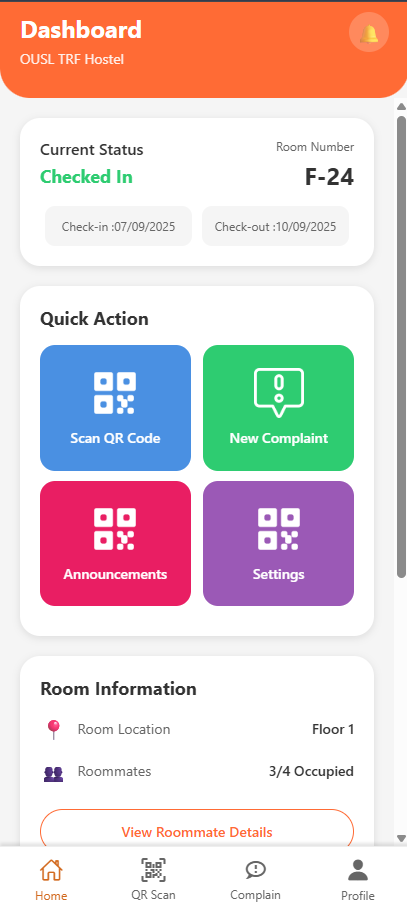
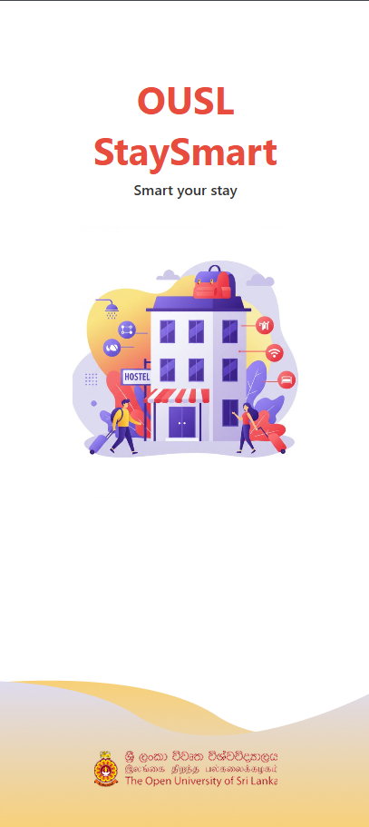
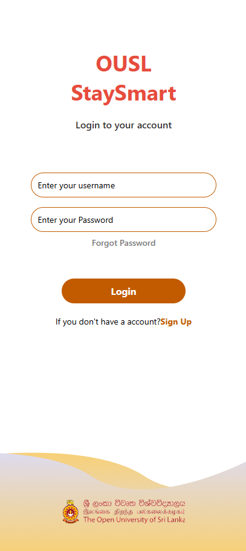
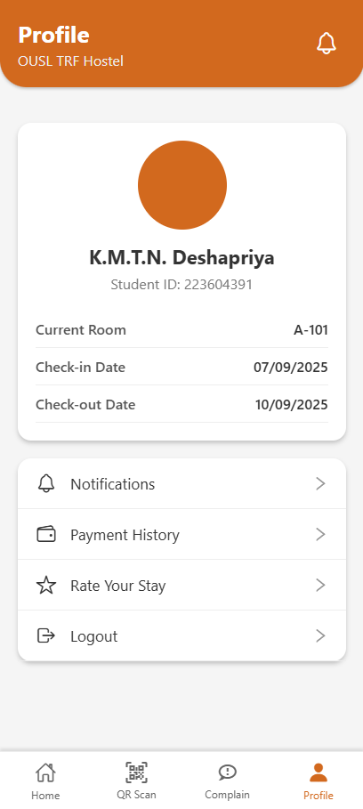
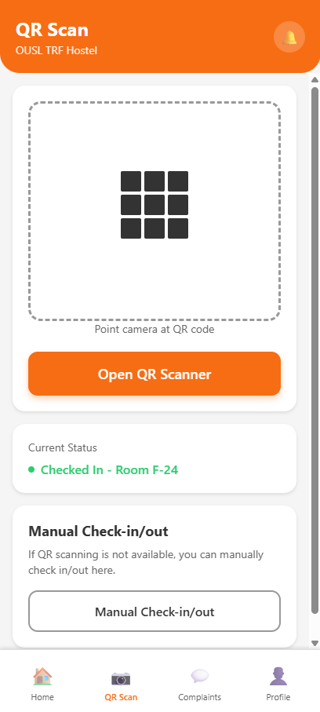

# 🏨 OUSL StaySmart - Hostel Management App

> A modern mobile application for OUSL hostel management built with React Native & Expo

[](https://reactnative.dev/)
[](https://expo.dev/)
[](https://github.com/OUSL-RAr2/hostal-management-mobile)

---

## 📖 About

**OUSL StaySmart** is a comprehensive mobile application designed for the Open University of Sri Lanka (OUSL) Trinity Residential Facility. It provides students with an intuitive interface to manage their hostel stay, view their profile, submit complaints, and access important information.

---

## ✨ Features

### 🏠 Dashboard
- View current room status and check-in/out dates
- Quick actions for common tasks (QR scan, complaints, announcements, settings)
- Recent activity feed
- Room information with roommate details

### 👤 Profile Management
- Student profile with personal details
- Room assignment information
- Check-in/out date tracking
- Notifications settings
- Rate your stay

### 🎨 Modern UI/UX
- Clean and intuitive interface
- Custom OUSL branding colors
- Vector icons for better visual experience
- Smooth animations and transitions
- Safe area support for all devices

---

## 🚀 Current Status

| Screen | Status | Features |
|--------|--------|----------|
| **Dashboard** | ✅ Complete | Status cards, quick actions, activities, room info |
| **Profile** | ✅ Complete | User info, room details, settings, options |
| **Login** | ✅ Complete | Authentication interface |
| **Start Screen** | ✅ Complete | Welcome/onboarding |
| **Color Demo** | ✅ Complete | Design system showcase |

### 🔄 In Progress
- QR Code Scanner
- Complaint Management
- Payment Integration
- Backend API

---

## 📱 Screenshots

<div align="center">

### Dashboard Screen


*Main dashboard with status cards, quick actions, and recent activities*

### Loading Screen


*Smooth loading experience with OUSL branding*

### Login Screen


*Clean authentication interface*

### Profile Screen


*Student profile with room details and options*

### QR Code Scanner


*Quick QR code scanning for hostel services*

</div>

---

## 🛠️ Tech Stack

- **React Native** - Cross-platform mobile framework
- **Expo** - Development platform and tools
- **@expo/vector-icons** - Icon library (MaterialCommunityIcons, Ionicons)
- **react-native-safe-area-context** - Safe area handling
- **JavaScript (ES6+)** - Programming language

---

## 📦 Installation

### Prerequisites
- Node.js (v16+)
- npm or yarn
- Expo Go app (for testing)

### Setup

```bash
# Clone the repository
git clone https://github.com/OUSL-RAr2/hostal-management-mobile.git
cd hostal-management-mobile

# Install dependencies
npm install

# Start the development server
npx expo start

# Or clear cache and start
npx expo start -c
```

### Run on Device
- **Android**: Press `a` or scan QR with Expo Go
- **iOS**: Press `i` or scan QR with Camera app
- **Web**: Press `w`

---

## 📁 Project Structure

```
hostal-management-mobile/
├── src/
│   ├── screens/              # Screen components
│   │   ├── dashboardScreen.jsx
│   │   ├── Profile.jsx
│   │   ├── LoginScreen.jsx
│   │   └── StartScreen.jsx
│   ├── components/           # Reusable components
│   │   └── dashboardScreen/
│   │       ├── BottomNavigation.jsx
│   │       ├── ActivityItem.jsx
│   │       └── QuickActionButton.jsx
│   ├── styles/               # Styles and themes
│   │   ├── colors.js
│   │   └── index.js
│   └── constants/            # App constants
├── assets/                   # Images and icons
├── App.js                    # Root component
├── app.json                  # Expo config
└── package.json              # Dependencies
```

---

## 🎨 Design System

### Color Palette

```javascript
Primary: #FF6B35    (Orange)
Text: #333333       (Dark Gray)
Background: #F5F5F5 (Light Gray)
Active Tab: #D2691E (Brown)
Success: #2ECC71    (Green)
```

### Components
- **BottomNavigation** - Reusable tab navigation
- **ActivityItem** - Activity card component
- **QuickActionButton** - Action button component

---

## 🌿 Git Workflow

### Branches
```
main              → Production-ready code
develop           → Integration branch
feature/*         → New features
fix/*             → Bug fixes
```

### Current Branches
- `feature/dashboard-screen` ✅
- `feature/profile-screen` ✅
- `feature/login-screen` ✅
- `fix/readme-file` 🔄

---

## 🤝 Contributing

1. Fork the repository
2. Create your feature branch (`git checkout -b feature/AmazingFeature`)
3. Commit your changes (`git commit -m 'Add some AmazingFeature'`)
4. Push to the branch (`git push origin feature/AmazingFeature`)
5. Open a Pull Request

---

## 👥 Team

**Course:** EEY4189 - Software Design in Group  
**Program:** BSE 3rd Semester  
**Institution:** Open University of Sri Lanka (OUSL)

### Development Team
- Project Lead & Developer
- UI/UX Designer
- Mobile Developer
- Backend Developer

---

## 📝 Recent Updates

### Latest Changes (v0.1.0)
- ✅ Added SafeAreaProvider wrapper to fix context errors
- ✅ Updated BottomNavigation with vector icons
- ✅ Replaced emoji icons with MaterialCommunityIcons & Ionicons
- ✅ Added active tab highlighting (#D2691E)
- ✅ Improved styling with elevation and shadows
- ✅ Fixed white screen issues

---

## 🐛 Troubleshooting

### White Screen?
```bash
npx expo start -c
```

### Metro Bundler Issues?
```bash
rm -rf node_modules
npm cache clean --force
npm install
npx expo start -c
```

### Module Not Found?
```bash
npm install @expo/vector-icons react-native-safe-area-context
```

---

## 📅 Roadmap

### Phase 1 (Current) ✅
- [x] Dashboard screen
- [x] Profile screen  
- [x] Login interface
- [x] Bottom navigation
- [x] Design system

### Phase 2 (Next)
- [ ] QR code scanner
- [ ] Complaint system
- [ ] Payment integration
- [ ] Notifications

### Phase 3 (Future)
- [ ] Room booking
- [ ] Meal management
- [ ] Visitor registration
- [ ] Analytics

---

## 📄 License

This project is part of academic coursework at OUSL.

---

<div align="center">

</div>
